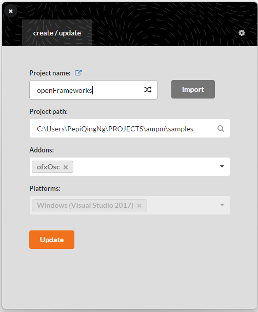
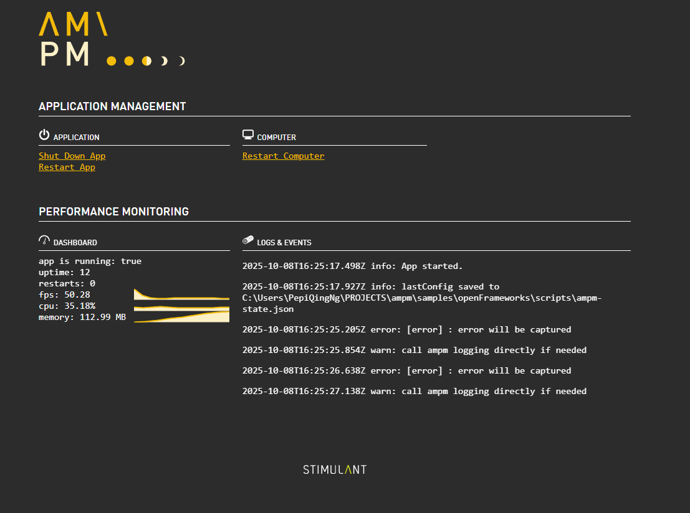

# On Windows

## Installing dependencies

- Make sure you're working in git branch "dependency-upgrade"
- In the root of this repository (/ampm), run:

```bash
npm install
```

## Build an OpenFrameworks app

- Make sure you have [OpenFrameworks](https://openframeworks.cc/download/) downloaded.
- Go to the openFrameworks directory, which you just downloaded.
- In openFrameworks/projectGenerator, run projectGenerator.exe.
- In projectGenerator, select the directory that this README file is saved in (ie. Users > Your Username > Downloads > ampm > samples)
  
- Click "Generate" to create the .sln file and bin/ folder

## Build the openFrameworks project

- Open the .sln file generated in Visual Studio on Windows (Use XCode on Mac).
- Cntl + Shift + B to build the project
- Once built, you should see openFrameworks_debug.exe being generated in "bin" directory.
- In "scripts/ampm.json", the "LaunchCommand" property should hold the correct path for openFrameworks_debug.exe

## Run the sample with ampm server

- In terminal, cd into scripts directory
- Run `ampm`. An OpenFrameworks sketch should open.

---

## Updates

- As of 8 Oct 2025, you should be able to view logs in the AMPM web console.
  
